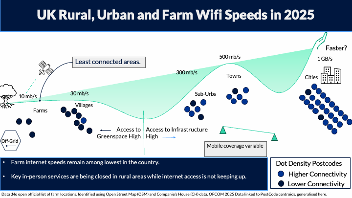

# Access to WiFi

Farm internet speeds remain among the lowest in the country despite increasing dependence on digital services.

## Why this matters

Access to services is increasingly digital. From healthcare and education to banking and government services, many everyday activities now depend on a reliable internet connection.

Communities with poor connectivity may face barriers to participation in modern society.

## Key Findings

### Farms remain among the least connected locations

Farming postcodes consistently recorded poorer internet connectivity than urban areas and generally performed worse than surrounding rural settlements, particularly when looking at higher-speed broadband services.

::: {.callout-note}
Farm internet speeds remain among the lowest in the country despite increasing dependence on digital services.
:::

### The gap widens at higher internet speeds

| Measure | Urban (%) | Rural (%) | Farm (%) |
|----------|---------:|---------:|---------:|
| Above USO | 99.95 | 98.67 | 96.87 |
| Access to ≥30 Mb/s | 97.94 | 86.46 | 68.51 |
| Gigabit Availability | 87.67 | 58.14 | 47.53 |

The largest differences emerge when considering access to high-speed and gigabit-capable broadband.

### Connectivity strongly reflects location

Access to broadband appears closely linked to infrastructure. Urban areas benefit from greater coverage, while connectivity decreases in more remote and dispersed settlements.

Farms often occupy the most geographically isolated locations and experience lower access to faster services.

### Rural classifications can hide inequality

The analysis suggests that broad urban-rural classifications may mask important differences within rural areas.

Farming communities often experience poorer connectivity than neighbouring villages despite both being classified as rural.

### Broadband access is geographically clustered

Spatial analysis identified significant clustering of broadband performance.

| Indicator | Moran's I |
|------------|----------:|
| Above USO | 0.373 |
| ≥30 Mb/s | 0.567 |
| Gigabit Availability | 0.637 |

Areas with good connectivity tend to be near other well-connected areas, while poorly connected areas also cluster geographically.

## Interpretation

Official statistics already show a rural-urban divide in connectivity.

Our findings suggest that some communities within rural areas, particularly farming households, may experience even greater disadvantage than broader rural averages suggest.

As services continue to move online, poor connectivity may reduce access to:

- Healthcare
- Education
- Employment
- Government services
- Social participation

## Limitations

::: {.callout-important}
There is currently no open national register of farm properties in the UK.
:::

This analysis therefore identifies likely farming locations using a combination of:

- OpenStreetMap
- Companies House records

Other limitations include:

- Use of postcode centroids rather than boundaries
- Postcode-level broadband data 
- No comparable mobile coverage data at postcode scale

## Future Research

Future work could explore:

- Deprivation and digital exclusion
- Mobile connectivity
- Household-level analysis through UPRN linkage
- Distance to telecommunications infrastructure
- Standardised UK-wide urban/rural classifications

## Reproducibility

### Methods

- Active Postcodes
- Rural / Urban Classification
- Spatial Linking
- Statistical Pipelines

### Resources

- GitHub Repository
- Analysis Notebooks
- OFCOM Connected Nations Data